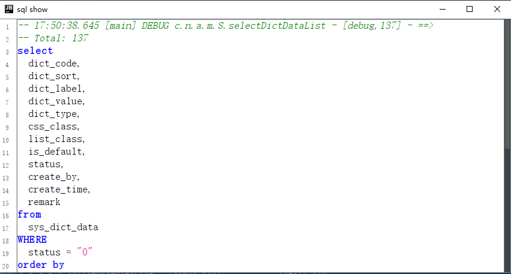
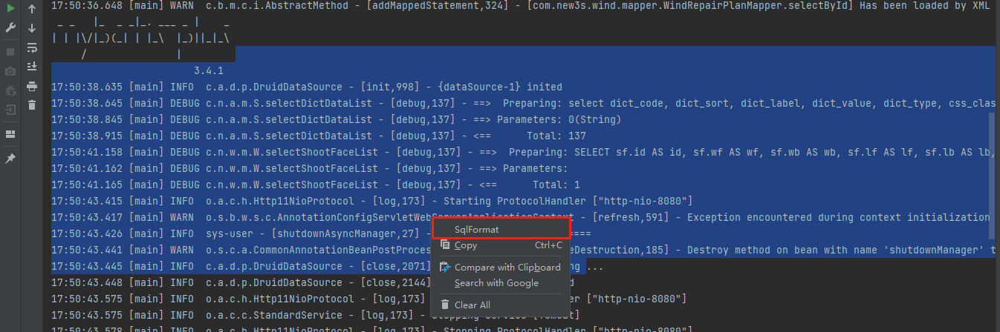
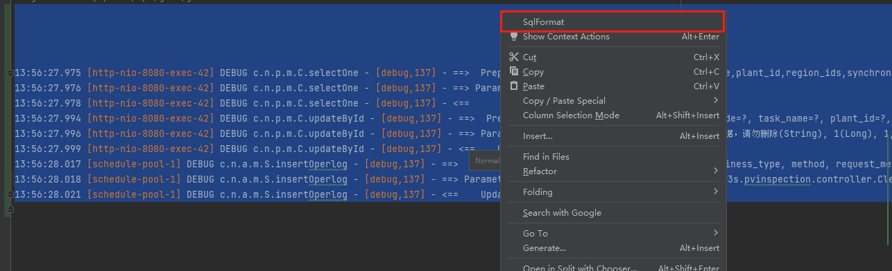

# MyBatis-Plus SQL Formatting Plugin
[中文](readme.md#简介)
## Introduction

This plugin simplifies the formatting of SQL queries within the MyBatis-Plus framework, ensuring standardized formats for enhanced readability and consistency.

## Usage

### Direct Console Selection

1. Select the SQL query directly in the console.
2. Right-click on the selected query.
3. Choose "sqlFormat" from the context menu for formatting.

   
 
### Log File Selection

1. Open a log file containing SQL statements.
2. Select the SQL statements you wish to convert.
3. Right-click on the selected statements.
4. Choose "sqlFormat" from the context menu for formatting.

These steps facilitate quick and accurate formatting of SQL queries.
