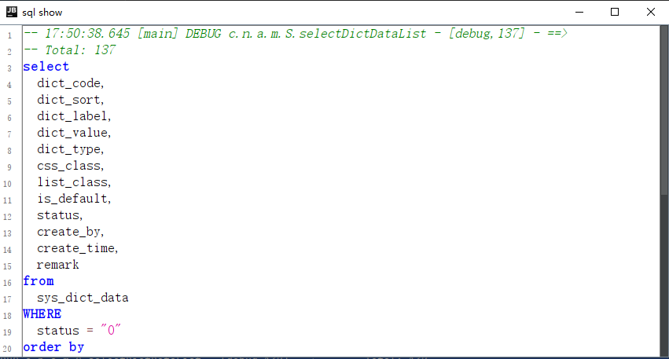

# MyBatis-Plus SQL 格式化插件
[English Version](readme-en.md#introduction)

## 简介

这个插件简化了在 MyBatis-Plus 框架中 SQL 查询的格式化过程，确保了标准化的格式，增强了可读性和一致性。

## 使用方法

### 直接控制台选择

1. 在控制台直接选择 SQL 查询。
2. 右键点击选定的查询。
3. 在上下文菜单中选择 "sqlFormat" 进行格式化。

### 日志文件选择

1. 打开包含 SQL 语句的日志文件。
2. 选择要转换的 SQL 语句。
3. 右键点击选定的语句。
4. 在上下文菜单中选择 "sqlFormat" 进行格式化。

这些步骤简化了 SQL 查询的快速和准确格式化。
